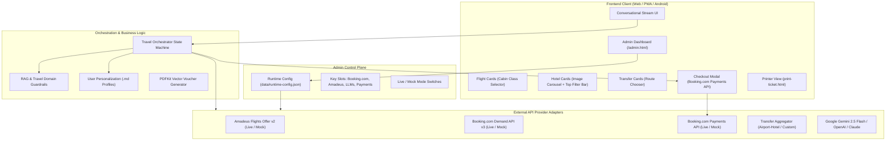

# SkyVoyage AI — Comprehensive GSD Implementation Planner (planner1_gsd.md)

**Project:** SkyVoyage AI — Conversational Travel Booking Assistant Framework  
**Date:** 2026-09-03  
**GSD Project Code:** TRAVEL-AI  
**Target Milestone:** v1.0 Production-Ready Framework  
**Git Repository:** [github.com/Shreyas-cpu/End-to-End-travel-bot](https://github.com/Shreyas-cpu/End-to-End-travel-bot)

---

## 1. Executive Summary & Project Vision

SkyVoyage AI is an AI-first, end-to-end conversational travel assistant framework designed to eliminate friction across traditional online travel agency (OTA) booking flows. Instead of forcing users across 5+ fragmented apps and complex web forms, SkyVoyage orchestrates standard travel itineraries (flights with cabin classes, accommodations with interactive photo carousels and multi-attribute filtering, airport/hotel ground transfers, and payment completion with printable vouchers) inside a single conversational thread.

The platform provides a modular architecture with:
1. **Interactive Rich Cards & Modern UI Controls:** In-stream flight cabin selectors, hotel photo carousels, sticky filter toolbars, area filters, max-price sliders, and 6-item pagination.
2. **Runtime Admin Control Plane (`/admin.html`):** A dedicated administrative portal allowing developers/operators to insert partner API keys (Booking.com Core, Booking.com Payments, Amadeus, and LLMs) and toggle between Mock and Live modes with instant effect without restarting servers.
3. **RAG Knowledge Base & Strict Travel Guardrails:** Prevents off-topic model hallucination and injects verified baggage rules, transit guides, and cancellation policies.
4. **Persistent Markdown User Personalization (`data/profiles/{userId}.md`):** Saves traveler preferences (seat preference, airline loyalty, desired hotel amenities like pools and breakfast, budget sensitivity, and past destinations) to personalize recommendations over time.

---

## 2. End-to-End Conversational Workflow

```
[1. Trip Initiation & Discovery]
       │
       ▼
[2. Flight Discovery & Multi-Cabin Selection]
       │  (Airline, times, stops, Economy / Premium / Business / First Class)
       ▼
[3. Hotel Booking Prompt ("Near Airport" Default)]
       │  (Multi-photo Carousel, Filter Toolbar: Price Sort, Area, Max Price Slider, 6-item Pagination)
       ▼
[4. Cab & Ground Transfer Prompt]
       │  (Airport ➔ Hotel, Hotel ➔ Airport, Custom Route, or Skip Transfer)
       ▼
[5. Itemized Trip Summary & Pricing Breakdown]
       │  (Flights + Hotel + Cab + 12% Mandatory Taxes/Fees)
       ▼
[6. Booking.com Payments API Checkout Handoff]
       │  (Booking.com Payment Session / Verified Fallback Mock Session)
       ▼
[7. Final Confirmation & Dual-Mode Printable Voucher]
          ├─► Download Vector PDF Ticket (PDFKit)
          └─► Direct In-Browser Printing (print-ticket.html + window.print())
```

---

## 3. System Architecture & Components



---

## 4. Key Architectural Features & Enhancements

### 4.1 Flight Cabin Class Tiering & Scheduling
- **Model Extension:** `FlightOffer` supports `cabinTiers` with dynamic pricing across **Economy**, **Premium Economy**, **Business**, and **First Class**.
- **Schedule Matching:** Natural language entity extractor parses optional departure/arrival preferences (morning, afternoon, evening, night).
- **Interactive Selection:** Flight cards render clickable cabin selector pills that instantly update the displayed fare and pass the chosen tier to checkout.

### 4.2 Hotel Carousel, Sticky Filter Toolbar & Pagination
- **Hotel Prompt & Default Location:** Chatbot explicitly prompts the user if they wish to book a stay, defaulting location to **"near the airport"** if unspecified.
- **Scrollable Photo Carousel:** Each hotel card features an interactive multi-image carousel with `<` and `>` navigation buttons and thumbnail indicators.
- **Top Filter Toolbar:**
  - **Price Sort:** Low-to-High (default) and High-to-Low.
  - **Area Filter:** All / Near Airport / City Center / Downtown / Historic.
  - **Max Price Range Slider:** Client-side slider updating the active budget ceiling in real time.
- **Pagination:** Top 6 accommodations display initially, with a prominent **"See More Accommodations"** button to reveal remaining items.

### 4.3 Multi-Directional Ground Transfers
- **Clear Prompt:** Yes/No prompt for ground transportation.
- **Route Options:**
  - `Airport ➔ Hotel`
  - `Hotel ➔ Airport`
  - `Custom Route` (prompts user for custom pickup and dropoff points in chat).
- **Skip Action:** One-click *"Skip Airport Transfer"* button cleanly advances to checkout.

### 4.4 Persistent Markdown User Personalization (`data/profiles/{userId}.md`)
- Individual user profile stored in readable Markdown.
- Automatically records airline loyalty, cabin preference, favorite hotel amenities (pool, gym, free breakfast, high floor), budget level, and past trips.
- Injected into the Gemini/LLM system context to deliver tailored recommendations without repetitive user questions.

### 4.5 RAG Knowledge Engine & Domain Guardrails
- **Knowledge Base (`data/knowledge/`):** Markdown documents covering airline baggage allowances, hotel check-in/cancellation rules, and airport transfer transit windows.
- **Strict Guardrail Prompt:** Injects domain boundary instructions into the LLM, politely deflecting off-topic queries (e.g. coding, math, general politics) and re-steering users to travel bookings.
- **Deterministic Rule Fallback:** Ensures continuous workflow even during external API downtime or rate-limiting.

### 4.6 Comprehensive Admin Dashboard (`/admin.html`)
- **Direct Login:** Accessible from the header link or `/admin.html` with credential verification.
- **API Key Slots:**
  - **Booking.com Core API Key & Affiliate ID** (Hotels, Flights, Cabs).
  - **Booking.com Payments API Key & Merchant ID / Secret** (Payment processing).
  - **Amadeus Flight API Key & Secret**.
  - **LLM Provider Selector & API Key Slot** (Google Gemini, OpenAI, Claude, Local).
- **Independent Live vs. Mock Toggles:** Toggle each provider between Mock and Live at runtime without server restarts.
- **Operational Auditing:** View active user chat sessions, passenger booking records, and download generated tickets.
- **RAG Knowledge Editor:** Edit policy markdown files directly in-browser.

### 4.7 Booking.com Payments & Dual-Mode Printable Summary
- **Trip Summary:** Transparent itemization of flights, hotel nights, transfer, 12% mandatory taxes/fees, and total package cost.
- **Booking.com Payment Gateway Flow:** Checkout modal communicating with Booking.com Payments API (with verified mock fallback when keys are pending).
- **Dual Confirmation Actions:**
  1. *"Download Official PDF"* — High-resolution vector PDF generated by PDFKit.
  2. *"Print Itinerary"* — Opens printer-optimized page (`public/print-ticket.html`) and auto-triggers `window.print()`.

---

## 5. Structured 8-Phase GSD Execution Roadmap

| Phase | Phase Name | Core Requirements | Deliverables & Tasks | Wave | Status |
| :---: | :--- | :--- | :--- | :---: | :---: |
| **01** | **Flight Cabin Classes & Scheduling** | FLT-01, FLT-02, FLT-03, FLT-04 | Multi-tier cabin pricing (`Economy`, `Premium`, `Business`, `First`), time-of-day parser (morning/evening), interactive card cabin selector. | 1 | **Planned** |
| **02** | **Hotel Carousel, Filters & Pagination** | HTL-01, HTL-02, HTL-03, HTL-04, HTL-05, HTL-06 | Prompt with "near airport" default, photo carousel, filter toolbar (sort, area, max price slider), 6-item pagination with "See More". | 2 | **Planned** |
| **03** | **Cab Transfer Routing** | CAB-01, CAB-02, CAB-03, CAB-04 | Yes/No prompt, Airport-to-Hotel, Hotel-to-Airport, custom routes, vehicle specs, and skip transfer option. | 3 | **Planned** |
| **04** | **User Profile Engine (`.md`)** | PRF-01, PRF-02, PRF-03 | `data/profiles/{userId}.md` engine, preference extraction, dynamic context injection into LLM recommendations. | 2 | **Planned** |
| **05** | **RAG Engine & Guardrails** | RAG-01, RAG-02, RAG-03 | Knowledge repository (`data/knowledge/`), semantic retrieval, prompt guardrails deflecting non-travel questions. | 3 | **Planned** |
| **06** | **Admin Dashboard & API Manager** | ADM-01, ADM-02, ADM-03, ADM-04, ADM-05, ADM-06, ADM-07 | `/admin.html` portal, runtime key manager (Booking.com Core & Payments, Amadeus, LLMs), mock/live toggles, session logs. | 4 | **Planned** |
| **07** | **Booking.com Payments & Printable Summary** | SUM-01, SUM-02, SUM-03, SUM-04, SUM-05 | Booking.com Payment API adapter, checkout modal, PDFKit receipt enhancement, and direct in-browser printing trigger. | 5 | **Planned** |
| **08** | **Integration & Verification** | Complete System | Vitest/Jest smoke test suite (`tests/orchestrator.test.ts`), responsive UI polish, full happy-path verification. | 6 | **Planned** |

---

## 6. GSD Artifacts & Verification Reference

All plan files have been generated and validated using the GSD CLI (`@opengsd/gsd-core`):
- **GSD Configuration:** `.planning/config.json`
- **Project Scope:** `.planning/PROJECT.md`
- **Checkable Requirements (32 items):** `.planning/REQUIREMENTS.md`
- **Phased Roadmap:** `.planning/ROADMAP.md`
- **Living Memory State:** `.planning/STATE.md`
- **Detailed Executable Plans:** `.planning/phases/*/*-PLAN.md`

---

## 7. Instructions for Resuming After Office Arrival

When you reach the office and resume this session:
1. Everything is committed and pushed to your GitHub repository:
   `git remote: orgin (https://github.com/Shreyas-cpu/End-to-End-travel-bot.git)`
2. Simply state:
   - *"Let's begin Phase 1"* (to start implementing Flight Cabin Classes), or
   - *"Execute all phases"* (to execute the full roadmap autonomously).
3. The assistant will read `.planning/STATE.md` and `planner1_gsd.md` and immediately pick up execution without losing context!
